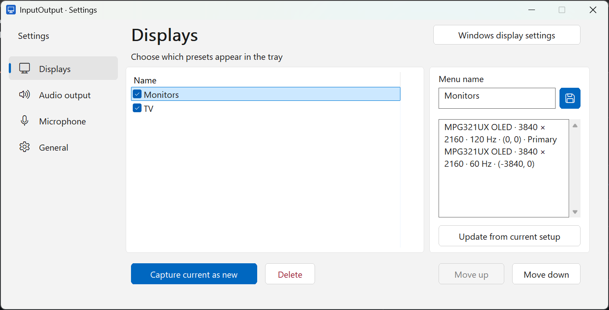
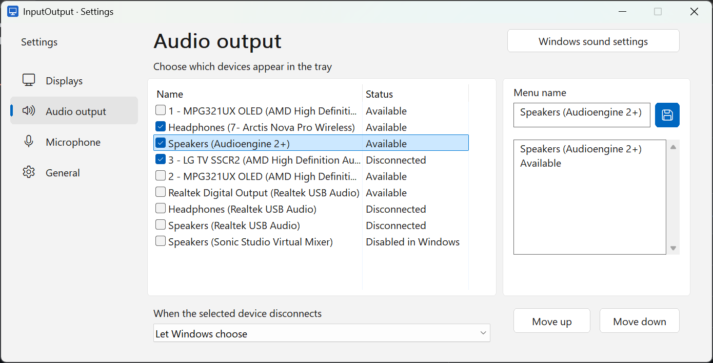

# InputOutput

**Switch screens and audio devices, with a single click!**

Move from two monitors and speakers to your TV and headphones in a few clicks. InputOutput lives in the Windows notification area and lets you choose displays, audio output, and microphone independently—no need to save every possible combination.

- **Your menu, your devices.** Show only the presets and devices you use, with names and ordering you choose.
- **Save your screen setups.** Restore monitor layouts, resolution, refresh rate, rotation, and the primary screen. Saved setups stay applied, with recovery if a switch fails.
- **Ready when you are.** Optional startup at sign-in, communication-device selection for calls, and fallback audio devices.
- **Small and quiet.** Native C++, roughly a 2 MB executable, no extra runtime or background polling.





**AI Disclaimer** This was vibe coded with ChatGPT Astra.

## Get started

Windows 11 · 64-bit

1. Run `InputOutput.exe` and open **Settings** from its tray icon.
2. Capture your display setups and tick the outputs and microphones you want in the menu.
3. Click the tray icon whenever you want to switch.

## Build

```powershell
.\build.ps1 -Bootstrap -Test -Package
```

The executable and portable ZIP are written to `dist`. The first build downloads a pinned compiler into the project folder.

[Usage and technical notes](USAGE.md) · [Testing guide](TESTING.md) · [License](LICENSE)
